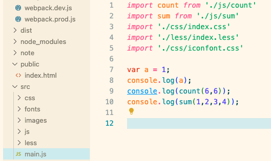
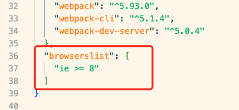
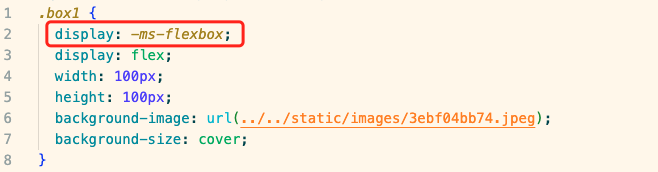

# CSS处理

## CSS加载处理

上图所示 css文件是在js文件中引入的  加载的时候需要先加载js  再加载css  js加载慢的话可能导致闪屏  这个问题需要解决：

**单独css文件，通过link加载，比较好，使用webpack插件：mini-css-extract-plugin**

这个插件会将css提取出来为单独文件，借助html插件的自动引入，最终的css文件以link的形式引入，性能得到优化

## CSS兼容性处理

JS的兼容性问题由Babel解决，CSS同样存在兼容性问题需要处理，使用：postcss-loader + postcss + postcss-preset-env

postcss-loader依赖于postcss  而postcss需要使用postcss-preset-env配置预设

兼容性做到什么程度需要在package.json中做配置：

下载完依赖在webpack配置文件中配置好postcss预设再进行编译

可以看到编译后的样式文件已经做了兼容性处理

## CSS压缩

使用webpack插件-css-minimizer-webpack-plugin对css进行压缩
