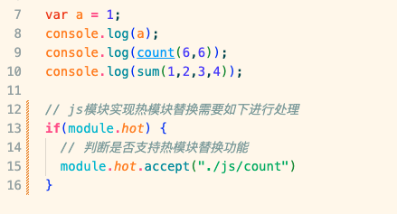

# 提升打包构建速度

## HotModuleReplacement（热模块替换/HMR）

问题：当修改一个模块后进行打包，webpack默认会对所有模块进行重新打包编译，速度很慢

改进思路：只对被修改的模块进行重新打包，其他没修改的模块不变，HMR就是做这个的

在webpack的配置中开启即可，但只对css有效，js模块需要做特殊处理

所有js模块都需要这样处理，很麻烦，幸好，在vue项目和react项目中，vue-loader和react-hot-loader已经实现了js模块的热模块替换，无需担心

## OneOf

问题：当webpack需要处理一个文件的时候，会对所有的loader进行遍历，找到合适的loader进行处理，也就是要对loader数组进行一个遍历，效率很低

改进思路：当遇到合适的loader的时候就使用，不再遍历其他loader

配置文件中的loader使用oneOf包裹即可

## Include/Exclude

问题：开发时会引入很多第三方的库，下载完成之后就会保存在node_modules中，并且这些文件是已经被编译过的，也就是说node_modules中的文件是不需要用webpack进行编译的。所以在对js文件进行处理的时候要排除node_modules中的文件

* include：只处理xxx文件
* exclude：排除，除了xxx文件以外的都处理

注意这两种方式只能用一种，否则会报错

## Cache

问题：每次打包JS文件都要经过Eslint检查和Babel编译，速度比较慢

解决思路：可以缓存之前的Eslint检查和Babel编译结果，这样二次打包时速度就会更快了

开启Babel缓存，第二次打包速度更快。缓存后的文件不需要压缩，压缩需要时间影响整体打包速度，并且缓存文件仅仅存在本地，不需要压缩

Eslint 也是在配置中可以开启缓存

## Thead

对于更加庞大的项目，打包的速度仍然需要优化，想要提升打包速度，就要对JS的打包进行优化，因为JS代码是最多的

对JS的处理主要是Eslint、Babel、Terser三个工具，电脑默认使用单线程对上述三个过程进行处理

改进：开启电脑的多个进程同时处理，加快速度

使用：

启动进程的数量就是我们CPU的核数

